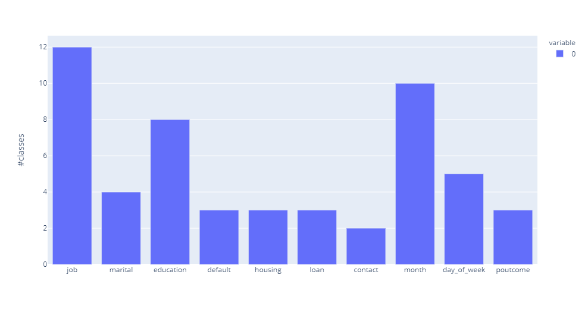

# Purpose of this repository

This repository is meant to be a blueprint for creating, maintaining, and
deploying a Machine Learning model in a professional environment. Of course,
this is only one out of many possible approaches, but maybe some of the content
may help you organize your project.

Predominantly this guide/repository contains all the steps necessary to build a
machine learning model. But it will also include all the small stuff required
to run it as a project in the real world, which includes: working on it as a
team, setting up data pipelines, and providing the results as a web API.  Sayed
that, I must admit that the most complicated part is left out: how to get a
dataset containing the labels in the first place.

This guide follows a hands approach and builds a model for a freely available
dataset on bank marketing
[https://archive.ics.uci.edu/ml/datasets/Bank+Marketing#]. Predicting a
marketing campaign's success may sound not very interesting, and honestly, it
is not. However, the data set is suited for this task for multiple reasons.
Most importantly, it is freely available. It is medium-sized, which means
handling the data and training models, doesn't need an enormous amount of
computing resources. Also, the problem is not too easy to solve, as the dataset
is quite imbalanced.

The complete guide contains:
1. [x] Setting up the environment
2. [x] Quickly to a functional prototype
    1. [x] Simple RandomForesetClassifier
    2. [x] FastAPI webapp [https://fastapi.tiangolo.com/]
    3. [x] Docker image
3. [x] Setting up data pipelines via DVC [https://dvc.org/]
4. [TODO] Exploring the data
5. [TODO] Trying different models and tune hyperparameters via optuna [https://optuna.org/]
6. [TODO] Setting up tests
7. [TODO] Improve FastAPI application
8. [TODO] Deploying the model to
    1. [TODO] AWS
    2. [TODO] Google cloud
    3. [TODO] Microsoft Azure


# Setting up the environment

## Conda

I start by setting up the working environment in which I do all the analyses,
experiments, and model building. For the package installation and handling,
the conda package manager is used. You can download the installer from
[https://docs.conda.io/en/latest/miniconda.html#linux-installers] and install
it via
```bash
bash Miniconda3-latest-Linux-x86_64.sh
```

Since conda is sometimes slow when resolving package dependencies, the
first package I install is mamba, a drop-in replacement for conda. However, be
warned, in its current state, mamba is experimental.
```bash
conda install mamba -n base -c conda-forge
```

The whole development is now done inside a conda environment, which can be
directly created from the yml file in this repo:
```bash
mamba env create --file model2cloud.yml
```

Now one can activate the environment via:
```bash
conda activate model2cloud
```

New packages can be installed by
```bash
mamba install $packagename
```
or better by adding it to the yml file followed by
```bash
mamba env update --file model2cloud.yml
```

## Jupytext - reviewable code

Jupytext is a tool to convert jupyter notebooks (ipynb) to plain python files,
see [https://jupytext.readthedocs.io/en/latest/].

Jupytext has multiple use cases: applying linting to notebooks, editing
notebook files with your preferred editor, doing version control, and enable
code review on your notebooks. For this repo, the third point is the important
one. Especially in teams, you might want to use code review before merging new
code into the master.

One can manually convert a notebook to a python file
via:
```bash
jupytext --to py $notebook_file
```
However, it is better to enable the synchronization between the notebook via the jupyter UI.
For this project, the synchronization is enabled for notebooks the following line
```bash
default_jupytext_formats = "ipynb,py:percent"
```
in the `jupytext.toml` file.

Synchronization means, whenever you save your notebook, jupytext updates the
corresponding python file.

### Jupytext commit hook

In principle, one could commit only the python code to git. The .py files are
better suited for reviewing the code and adding comments. When somebody checks
out the python file, the corresponding notebook is automatically created.
However, to understand a notebook's content, I find the figures quite crucial
to understand the content. As the ideas and findings presented in a notebook
are probably more important than the code itself, for me, it is essential to
have all the generated output available in a review.

This approach comes with two drawbacks. The git repository contains now all
images from the notebooks, increases in size significantly. If you want to
readable notebooks in the repository this is not avoidable. The second
drawback is that the ipynb and python files could come out of sync, this one
can prevent a pre-commit hook as given in `githooks/pre-commit`.

To enable these githooks, you can configure your hook path via:
```bash
git config core.hooksPath githooks/
```

# Quickly to a functional prototype

So that is enough configuration for the beginning. The next part cares around
creating a prototype and exposing it via a web API. The idea behind the
preliminary model is to get as fast as possible to running code which serves
two purposes:
1. Give a baseline performance.
2. Provide other teams/developers something against which they can develop

Using the first model, one can already estimate how complex the final problem will be.
For example, if you need a prediction with 90% accuracy for production and the
preliminary model achieves already 85%, one could expect that this gap can be indeed
closed with a decent amount of work. If the preliminary model only reaches 60% accuracy,
it might be that you have a long way in front of you.

A working prototype also helps when cooperating with other teams or developers.
If your prediction is used in a more complex application, others can already
develop their solution (frontend or backend application) against your model.
You can then improve your model iteratively, for example, in a Scrum or Kanban style.

## First look into the data

In general, one should strive for a deeper understanding of the data and it's
context, which allows to tailer the model to the use case and quench out the
last bit of performance.  However, the first model should be developed as fast
as possible. Still, a minimum amount of exploratory data analysis is needed to
generate any meaningful results.

In `notebooks/01_FirstLookIntoData.ipynb` I check at least who the target
variable looks like. In particular, `data['y'].value_counts(normalize=True)`
shows that the dataset is imbalanced, 11% positive cases. This must be
respected even in the first prototype. Even the prototype should not use an
unsuitable metric. For this dataset, accuracy will be certainly not very
useful.
### NA's

Luckily, there are not NA values in this dataset (`data.isna().sum()`).
Otherwise, these have to be also handled for the prototype.

### Categorical variables

For the first model, I check that enough samples are present in the dataset for
each class in each category, and I don't need to group these, which only occur
seldomly. 


## First stupid model

The random forest in `notebooks/02_FirstModel.ipynb` is trained on 80% of the
data and tested on the remaining 20%. To encode the categorical columns,
I use the OneHotEncoder from category_encoders [https://contrib.scikit-learn.org/category_encoders/].

The dataset must be split into a proper train, validation, and test set for
later experiments, but having a single test set is acceptable for the first
model.

For now, I use balanced accuracy to evaluate the model. This needs a
later revisit, but for now, the model achieves a balanced accuracy of 73%. Not
bad, for almost no work. At least at first sight. Later I will show hints
that some of the input features are flawed, and using them will may result in
good results on this training set but would lead to problems when used on new
data. In the last section of the notebook, the model is trained on the full
dataset and saved as a pickle file for later usage.

In the last section of the notebook, I train the model on the full dataset and
save it as a pickle file for later usage.

## First FastAPI application

The next step is to cast the ready model into an application. For that purpose, I use
the fantastic FastAPI library [https://fastapi.tiangolo.com/]

In `app/input.py`, I define the input data for the model. FastAPI automatically creates a schema from this using another
fantastic python library: pydantic [https://pydantic-docs.helpmanual.io/].

The actual app `app/simpleapp.py` mainly does two things.

Firstly it loads in the stored pickle files. The custom unpickler is needed since the
model is pickled within the notebook, and thus the context from which the app is executed
would not find the corresponding python classes.
```python
class CustomUnpickler(pickle.Unpickler):

    def find_class(self, module, name):
        try:
            return super().find_class(__name__, name)
        except AttributeError:
            return super().find_class(module, name)

encoder_file = 'model/simple_enc.pkl'
model_file = 'model/simple_rf.pkl'

logging.debug(f'Loading model from {model_file}')
model = CustomUnpickler(open(model_file, 'rb')).load()
encoder = CustomUnpickler(open(encoder_file, 'rb')).load()
```

The other relevant lines create the endpoint, transform the incoming data into a DataFrame,
execute the model, and return the prediction.
```python
@app.post('/predict')
def predict(data: ClientDataSimple):
    # transform dict to pandas DataFrame
    data_as_dict = {key: [value] for key, value in data.dict().items()}
    df = pd.DataFrame.from_dict(data_as_dict)
    x = encoder.transform(df)
    preds = model.predict(x)
    preds = pd.Series(preds)

    # transform result back to original presentation
    preds = preds.map({0: 'no', 1: 'yes'})

    return preds.to_json(orient='records')
```

To start the application, execute:
```bash
uvicorn simpleapp:app --reload
```

That's it. Even better, FastAPI also provides also an OpenAPI specification
under `http://127.0.0.1:8000/openapi.json` and a Swagger UI under
`http://127.0.0.1:8000/docs`, which one can use to test the API.

## Make API available via docker

Now the application runs on your computer, great but not especially helpful for
providing the API to others or even deploy it to some cloud providers. One of
the easiest ways to do so is to pack the application into a docker image (see
[https://docs.docker.com/get-started/]).

To create a docker image for the FastAPI application is done quite fast
(`./Dockerfile`). It just copies the application, installs the requirements
via pip, and starts the application.
```docker
FROM tiangolo/uvicorn-gunicorn-fastapi:python3.8

WORKDIR /var/app

COPY app/ .

RUN pip install --upgrade pip
RUN pip install -r requirements.txt

EXPOSE 8000
CMD ["uvicorn", "simpleapp:app", "--host", "0.0.0.0", "--port", "8000"]
```

The docker image can now be built by
```bash
docker build -t api4model2cloud
```
and started by
```bash
docker run --rm -t -i -p 8000:8000 --name=api4model2cloud api4model2cloud
```

As when starting the application from the shell, you can now access the Swagger
UI by accessing `http://127.0.0.1:8000/docs`. The former commands are put into
a Makefile `(./Makefile)` to ease the development, such that make build and
make run are sufficient to build and test the docker image.  The docker image
can now be uploaded to your choice's docker registry and grabbed there by your
colleagues.


# Setting up data pipelines via DVC

It becomes quite a mess when multiple people work on the same project with the
same data. As soon as people start to copy data, share preprocessed data, or
update the base data manually, it becomes a mess to overview which state of the
data is used.

DVC is a tool that comes to the rescue to cope with these problems
[www.dvc.org]. DVC allows us to have a kind of version control for data, makes it
easy to share data, manage pipelines and experiments, and allows reproducible
results.

Usually, DVC is also used to have a shared data repository, used to share data
with all project collaborators. However, in this project, I use DVC only for
managing data transformation pipelines and training models. In
[https://dvc.org/doc/user-guide], you can find a detailed guide; I will only
show the bare minimum of what is possible with DVC.

First, the repository must be initialized via
```bash
dvc init
```

The next step is to track the input data as an external resource.
```bash
dvc import-url https://archive.ics.uci.edu/ml/machine-learning-databases/00222/bank-additional.zip data/
```
The command downloads the dataset and puts it into the `data/` folder. If the dataset
would change, you or one of your colleagues could update the initial input data
via
```bash
dvc update data/bank-additional.zip.dvc
```

The first pipeline step doing real work is unpacking the data and moving it to
the right destination. The following command creates a pipeline set that unzips the
data, moves it to the right place, and remove the remnants.
```bash
dvc run -n unzip_data -d data/bank-additional.zip \
    -o data/bank-additional-full.csv \
    -o data/bank-additional-names.txt \
    -o data/bank-additional.csv \
    'unzip data/bank-additional.zip -d data/ && mv data/bank-additional/bank-additional* data/ && rm -rf data/__MACOSX && rm -rf data/bank-additional'
```
Running the above command creates a file named 'dvc.yaml', which includes the
following lines representing the pipeline step.
```yaml
stages:
  unzip_data:
    cmd: unzip data/bank-additional.zip -d data/ &&
         mv data/bank-additional/bank-additional* data/ &&
         rm -rf data/__MACOSX && rm -rf data/bank-additional/
    deps:
    - data/bank-additional.zip
    outs:
    - data/bank-additional-full.csv
    - data/bank-additional-names.txt
    - data/bank-additional.csv
```

The basis of each pipeline step is the command (cmd) which defines how the
input (deps) transforms to the output (outs). DVC automatically tracks the
current state of the input and output via checksumming; see `dvc.lock`.
Whenever you execute `dvc repro`, DVC detects changed inputs and know which steps
must be repeated to generate the new output. Just try it out, delete all the
generated csv and txt files and execute `dvc repro`.

DVC will create a graph of all dependencies so that whenever one of your
collaborators change any dependency, you can execute `dvc repro` and DVC will
care to update all output which depends on the modified input.

I will edit the dvc.yaml file directly instead of running the tedious dvc run
commands for all further steps.

The following pipeline step will take the csv file and transform it into a
parquet file. The parquet file stores the data type save and more efficiently
than a csv file so that further steps can read the parquet file and don't need
to transform the types of each column itself.

On could do this by executing a simple python script, but here I will use the
opportunity to show how to integrate a jupyter notebook into a DVC step.
To do so, one could employ `nbconvert --execute`, but I will wrap this
execution into a shell script that ensures that jupytext synchronizes the
notebook and its python representation and convert the notebook to HTML.  There
are situations where viewing notebook output becomes quite handy, for example,
when you want to create reports or wish to have a quick overview when data
changes.

```bash
# syncs given notebook in python format and converts the ipynb file into HTML after running it

# exit on first error
set -e

SCRIPTDIR=`dirname $0`

if [ "$1" == "" ]; then
    echo "Name of the notebook is missing"

    exit
else
    NOTEBOOK=$1
fi

if [ -f $NOTEBOOK ];then
    IPNYB_NOTEBOOK=${NOTEBOOK%%.py}.ipynb

    # if the notebook exists, just sync it (use the newest version)
    # if not, create it
    if [ -f $IPNYB_NOTEBOOK ];then
        jupytext --sync ${NOTEBOOK}
        else jupytext --to notebook ${NOTEBOOK}
    fi

    jupyter nbconvert --ExecutePreprocessor.timeout=-1 --to html --execute ${IPNYB_NOTEBOOK}
else
    echo "${NOTEBOOK} does not exists"
    exit 1
fi
```

The script above is now used in the following dvc step.
```yaml
  raw_to_parquet:
    cmd: scripts/run_with_conda.sh notebooks/preprocessing/check_and_convert_input.py
    deps:
    - scripts/run_with_conda.sh
    - data/bank-additional-full.csv
    outs:
    - data/bank-additional-full.parquet
```
to convert `data/bank-additional-full.csv` into `data/bank-additional-full.parquet`, see `notebooks/preprocessing/check_and_convert_input.py`.

# Exploring the data

So enough of all the annoying but necessary trivia, back to the real "Data
Science" work. For a real improvement of the model, we need to understand the
data better. You can find the following steps and explanations in the notebook
`./notebooks/03_EDA.ipynb`. Although the dataset may contain many interesting
facts and insights in the marketing campaign, I only target aspect relevant for
developing and improving the machine learning model. 

Here I want at least mention the most important finding. The data stems from
previous campaigns, which had not a very constant throughput.


However, the success rate seems to depend crucially on the number of attempts.

.

So it might not be a good idea to use the month as an input feature. Even more,
all social and economic attributes are given on a monthly base or a quarterly
base. This effect could harm the performance of the model for the real-world
case.

When one looks at the numbers and considers that the correlation between the
count and success probability is ~0.81, one could conclude that the number of
attempts is the primary influence on the success rate.

| month |  count |      prob |
|:------|-------:|----------:|
| mar   |    546 | 0.505495  |
| apr   |   2632 | 0.204787  |
| may   |  13769 | 0.0643474 |
| jun   |   5318 | 0.105115  |
| jul   |   7174 | 0.0904656 |
| sep   |    570 | 0.449123  |
| oct   |    718 | 0.438719  |
| nov   |   4101 | 0.101439  |
| dec   |    182 | 0.489011  |

Using only this dataset, I see no ways to solve this problem. There is a need
to understand what happened during marketing to understand this effect and find
the root cause.

Nevertheless, here I won't bother with this. As an example,
the dataset is still sufficient if I ignore this effect. Still, I won't use the
month as an input feature since it does not make any sense. If you want to
select the most probable customers at a particular time point, the month is
obviously identical for all customers. 

The correlation of the success rate to the number of attempts and thus to the
month make it also questionable to use the monthly/quarterly socio-economic
features.

Firstly, these features are also identical for all customers at a particular
time point. Secondly, one might argue that they still could be helpful since
different customers react differently in the same socio-economic background,
but the variance in these features is relatively low. Thus there is not too
much in the dataset a model could learn from.
